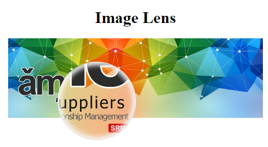

# Image-Lens

Image Lens is a light weight JS code adds a magnifier utility to your images



[See it live on CodePen](https://codepen.io/ahmad_511/full/jOVgjZy)

## The Concept

First we set the image source to the full size images (manually by the user),

After that we mark all images we need to add the magnifier to by adding `use-lens` attribute to it,

Then user may use css (ex. max-width, max-height, width, height) to reduce the image size as needed

The code then will listen to the images mouse enter event and the document's mouse move event,

When the mouse is withing an image bounding rectangle we do the following:
* Dislay the lens
* Update the lens background image to match the current image
* Calculate current image width/height zoom factors
* Calculate the lens background position based on current image's natural width and height

## Usage:
* Add use-lens attribute to all images you want to allow using the lens on

* Use css (or js) to reduce your images size as needed (the code below is targetting only images with `use-lens` attribute
```css
img[use-lens] {
    max-width: 500px;
}
```

* Include both img-lens.js and img-lens.css in your html file
```html
<link rel="stylesheet" href="img-lens.css">
<script src="img-lens.js" defer></script>
```

That's it

## Notes:
The default lens size is 150x150 and wich can be changed in the last line of img-lens.js file,

I wanted it to be a zero-config tool at least for now
